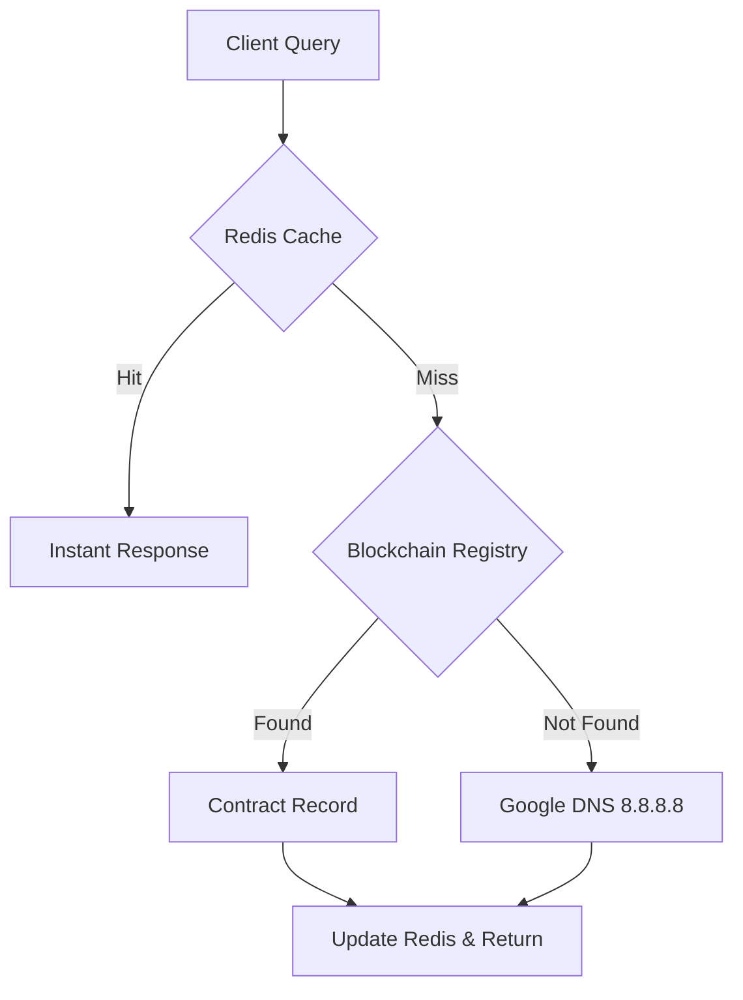

# 🌐 Dancing DNS Platform

[](#)
[](#)
[](#)

Dancing DNS is an institutional-grade, high-performance DNS resolution platform that bridges the gap between traditional networking and blockchain security. By storing DNS records as immutable smart contract state and accelerating resolution with Redis, we provide a censorship-resistant, ultra-fast alternative to centralized resolvers.

---

## 🚀 Live Environment

- **Public DNS Resolver:** `dns.vishaldev.space`
- **Dashboard:** [Managed Web Interface](#) (AWS Deployed)
- **Primary Contract:** `0xFE30bdfC40b0EE84c08a2030d65cf8d6f94E54FE` (Sepolia)

---

## 🛠️ Tech Stack

### Frontend & UI/UX
- **Next.js 15**: App Router, Server Components.
- **Tailwind CSS**: Modern utility-first styling.
- **Lucide React**: Premium iconography.
- **Shadcn UI**: Institutional-grade components.

### Backend Infrastructure
- **Node.js**: Evented I/O for the core resolver.
- **dns-packet**: Efficient DNS encoding/decoding.
- **Redis (Cloud)**: High-speed caching layer.
- **PM2**: Process management for 24/7 uptime on AWS.

### Blockchain & Web3
- **Thirdweb SDK**: Secure contract interactions.
- **Sepolia Testnet**: Decentralized registry host.
- **Solidity**: Smart contracts for domain ownership.

### Deployment & DevOps
- **AWS (EC2/LTS)**: High-availability hosting.
- **Git**: Advanced versioning and historical hygiene.

---

## 🏗️ Architecture

The platform follows a three-tier resolution strategy to ensure maximum uptime and performance:

1.  **⚡ Redis Acceleration**: Every query first checks a high-availability Redis cache. Successful resolutions (both blockchain and upstream) are cached to achieve sub-60ms latency.
2.  **🔗 On-Chain Resolution**: If not cached, the server queries the **Thirdweb-managed Smart Contract**. This provides the "Source of Truth" for decentralized domains.
3.  **🔄 Upstream Fallback**: For standard TLDs not managed on-chain, the server forwards queries to **Google DNS (8.8.8.8)** and caches the results.



---

## 🛠️ Project Structure

-   `dns-server/`: The core Node.js DNS resolver. Handles UDP packets, Redis logic, and Blockchain lookups.
-   `dns-frontend/`: Next.js 15 dashboard for managing domains, resolving records, and viewing network health.
-   `dnscontracts/`: Solidity smart contracts for the on-chain registry.

---

## ⚙️ Setup & Deployment

### Server Configuration
The server requires a `.env` file in `dns-server/` with the following:
```env
REDIS_HOST=...
REDIS_PORT=...
REDIS_PASSWORD=...
DNS_PORT=53
```

### AWS Deployment
The server is optimized for AWS (EC2/ECS). 
-   **Security Group**: Ensure port `53/UDP` and `53/TCP` are open for DNS traffic.
-   **Execution**:
    ```bash
    cd dns-server
    npm install
    npm start
    ```

---

## 🛡️ Security Features

-   **Domain Sanitization**: Automatic handling of trailing dots and case-sensitivity to prevent resolution spoofing.
-   **Rate Limiting**: Integrated Redis-based rate limiting to prevent DDoS attacks on the resolver.
-   **Immutable Records**: All DNS mutations require a cryptographic signature from the domain owner.

---

## 📜 License
Privately developed for the DNS Management Modernization project.
